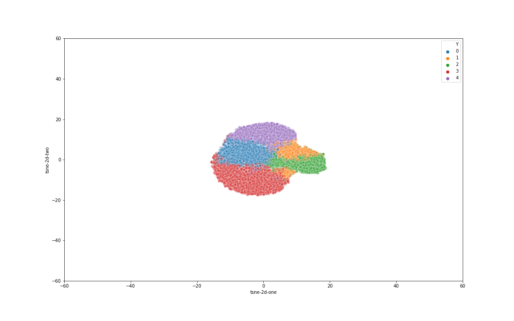

Trong note này em liệt kê các bước dùng tool blast để tính hiệu suất trên tập AMD.

#### Các bước chuẩn bị dữ liệu cho AMD
##### Preprocess dữ liệu đem đi phân cụm
- Input: 2 file fasta.13696_environmental_sequence.020 và file fasta.13696_environmental_sequence.007.
- Output: nối file xxx.020 vào đuôi của file xxx.007 được 1 file chứa các read hoàn chỉnh.

##### Tạo database theo format của blast cho các tập chứa scaffold
- Với mỗi file fasta chứa scaffold (**input.fna**) của từng loài, tạo database cho nó theo format của blast như sau (**blastdb**), với **-dbtype prot** là kiểu database protein (vì mình sẽ dùng blastx để align từ nucleotide sang protein):

```
    makeblastdb -in input.fna -parse_seqids -dbtype prot -out blastdb
```

- Với 5 loài, cuối cùng mình sẽ có 5 database.

#### Kết quả phân cụm

- Parameters: k-mer, l-mer, number of shared reads, maximum seed size đều dùng giống của tập R (long read).



Mô tả kết quả phân cụm.

#### Quy trình dùng blast để align kết quả

- Từ kết quả phân cụm, em tạo ra 5 file fasta format tương ứng với 5 cluster, chứa các read thuộc về cụm đó, mỗi file có format như sau:

```
    \>seq0

    NNNNNNGGGATTGCTGGTCCCCTAAACTTACTAAGTGCAAATTAAAGAGGTTAATGGCCTAAGACAGTGTGGAGGTAGGCT

    \>seq1

    AGTGCATTAAAGAGGTTAATGGCCTAAGACAGTGTGGAGGTAGGCTTAGAAGCAGCCATCCTTCAAAGAGTGCGTAACAGC

    ...

```
- Sau đó, với mỗi file kết quả phân cụm, em dùng tool blastx (translated nucleotide -> protein) như sau:

```
    blastx.exe -db blastdb_1 -query cluster_1.fna -out blast_result_1.txt
```

- Với **cluster_1.fna** chứa các read thuộc về cụm 1 (cluster_2.fna là cụm 2, ...). **blastdb_x** là database tương ứng cho từng scaffold của từng loài (ví dụ, blastdb_1 là database cho loài 1).


- Mỗi cụm được query lần lượt với các database của từng loài -> 5x5 lần chạy tool blastx.

- Kết quả hiệu suất phân cụm hiện tại chưa hoàn thành, vì trong file result em tìm thì không thấy hits found. Đang tiếp tục chạy ạ.