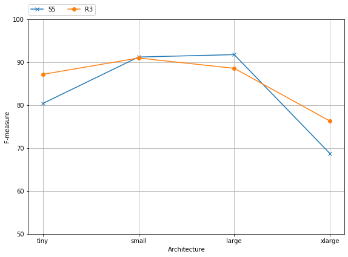
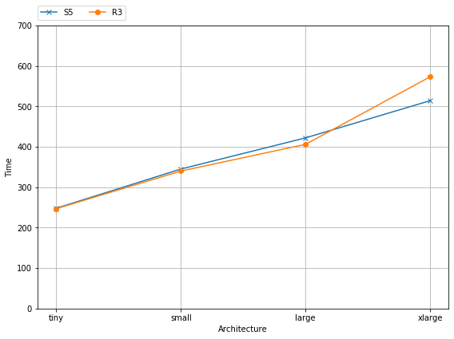

- Bảng bên dưới cho thấy performance và thời gian xử lý của 2 tập dữ liệu S5 và R3 khi được chạy trên các kiến trúc mạng khác nhau với độ phức tạp tăng dần.
   - Về performance: kiến trúc **large** cho kết quả tốt nhất trên tập S5, kiến trúc **small** cho kết quả tốt nhất trên tập R3, trong khi đó, kiến trúc **xlarge** cho kết quả tệ nhất cho cả 2 tập. Điều này cho thấy, độ phức tạp của kiến trúc mạng ảnh hưởng tới hiệu suất phân cụm, cụ thể, nếu kiến trúc mạng quá đơn giản (shallow network), nó không đủ khả năng để mô tả latent space tốt cho việc phân cụm; ngược lại, nếu kiến trục mạng quá phức tạp (deep network), sẽ dẫn đến vấn đề overfitting khi học latent space, làm cho latent space được sinh ra không có ý nghĩa phân cụm. ---> chỗ này em nghĩ có thể dẫn ra các latent space.
   - Về thời gian xử lý (nhìn vào chart): thời gian xử lý tăng dần theo độ phức tạp của kiến trúc mạng, trong khi hiệu suất phân cụm không tăng nhanh như vậy. Do đó, cần cân nhắc tradeoff giữa hiệu suất và thời gian xử lý khi chọn kiến trúc mạng.

   - Kết luận: kiến trúc **small** cho kết quả tốt nhất nếu trung hòa 2 yếu tố là hiệu suất và thời gian thực thi.

### Table

|  Architecture|                | tiny        | small     | large      |   xlarge      |
:----------------:|:-----------:|:-----------:|:---------:|:----------:|:---------------
|S5      | F-measure            | 80.49%      |  91.21%   | 91.77%     | 68.75%        |
|        | Time                 | 248s        | 345s      | 422s       | 514s          |
|R3      | F-measure            | 87.18%      | 90.98%    | 88.59%     | 76.30%        |
|        | Time                 | 247s        | 340s      | 406s       | 573s          |

# Chart

