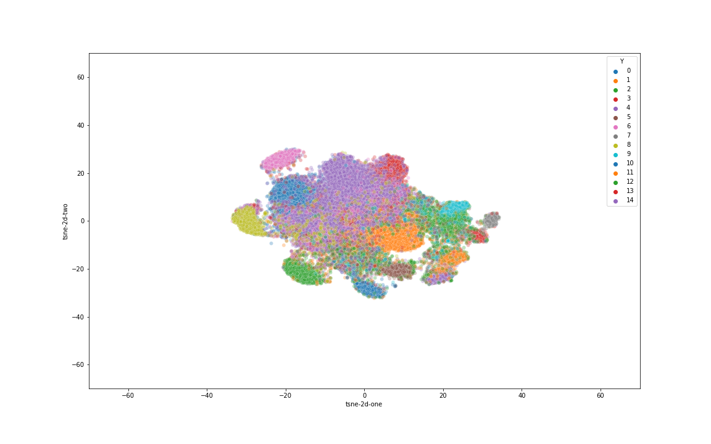

## Dataset S6:

#### After pretraining

#### Clustering

- The latent space từ epoch có performance tốt nhất:

## Dataset S9:

#### After pretraining

#### Clustering

- The latent space từ epoch có performance tốt nhất:

