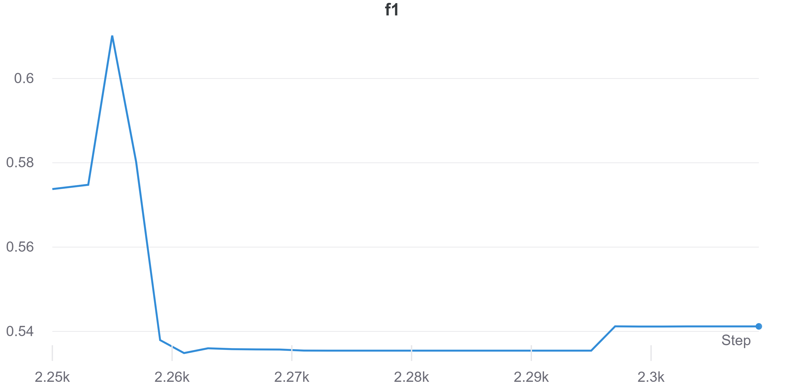
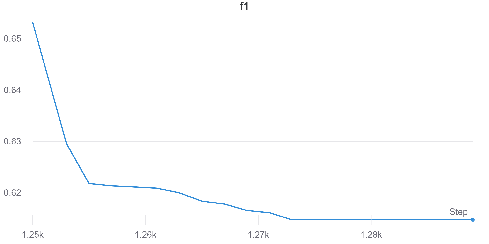

Em gửi thầy phần setup cho từng dataset (AMD, HMP).
- AMD (kết quả tốt nhất tại setup 3): để có kết quả tốt nhất thì 3 tham số thay đổi (kiến trúc mạng, group size, learning rate).
    - Setup1 và setup2: cùng architecture, learning rate, chỉ khác group size (200 và 50).
    - Setup3: architecture sâu hơn, khác learning rate, group size 50.
- HMP (kết quả tốt nhất ở setup 2): chỉ thay đổi kiến trúc mạng để có kết quả tốt nhất.

## AMD dataset

### Setup 1

- Architecture: [136-500-1000-10-1000-500-136]
- Learning rate: 0.001
- Group size: 200

### Result:
- prec: 73.7%
- recall: 57.8%
- f1: 64.8%
- Final MSE loss: 0.09672

| prec             | recall             | f1             |
:-------------------------:|:-------------------------:|:-----------------------------:
  |   | 

| MSE loss |
:-------------------------:

<!--  -->

### Setup 2

- Architecture: [136-500-1000-10-1000-500-136]
- Learning rate: 0.001
- Group size: 50

### Result:
- prec: 68.2%
- recall: 55.2%
- f1: 61%
- Final MSE loss: 0.1344

| prec             | recall             | f1             |
:-------------------------:|:-------------------------:|:-----------------------------:
  |   | 

| MSE loss |
:-------------------------:

<!--  -->

### Setup 3

- Architecture: [136-500-500-2000-10-2000-500-500-136]
- Learning rate: 0.0001
- Group size: 50

### Result:
- prec: 92%
- recall: 57.5%
- f1: 70.7%
- Final MSE loss: 0.0816

| prec             | recall             | f1             |
:-------------------------:|:-------------------------:|:-----------------------------:
  |   | 

| MSE loss |
:-------------------------:

<!--  -->

## HMP dataset

### Setup 1

- Architecture: [136-500-1000-10-1000-500-136]
- Learning rate: 0.001
- Group size: 200

### Result:
- prec: 68%
- recall: 58.1%
- f1: 62.6%
- Final MSE loss: 0.5372

| prec             | recall             | f1             |
:-------------------------:|:-------------------------:|:-----------------------------:
  |   | 

| MSE loss |
:-------------------------:

<!--  -->

### Setup 2

- Architecture: [136-500-500-2000-10-2000-500-500-136]
- Learning rate: 0.001
- Group size: 200

### Result:
- prec: 79.9%
- recall: 58.4%
- f1: 67.5%
- Final MSE loss: 0.501

| prec             | recall             | f1             |
:-------------------------:|:-------------------------:|:-----------------------------:
  |   | 

| MSE loss |
:-------------------------:

<!--  -->
